Lecture-06 Examples
================
Christopher Prener, Ph.D.
(February 18, 2019)

## Introduction

This notebook covers basic map production in `R` using a variety of
tools for producing *static* maps (as opposed to the interactive maps
`leaflet` makes).

## Dependencies

This notebook requires a variety of packages for working with spatial
data:

``` r
# tidyverse packages
library(ggplot2)      # plotting data

# spatial packages
library(mapview)      # preview spatial data
library(tmap)         # map layouts
library(sf)           # spatial data tools
```

    ## Linking to GEOS 3.6.1, GDAL 2.1.3, PROJ 4.9.3

``` r
# other packages
library(here)         # file path management
```

    ## here() starts at /Users/chris/GitHub/SOC5650/LectureRepos/lecture-06

``` r
library(RColorBrewer) # color palettes
library(viridis)      # color palettes
```

    ## Loading required package: viridisLite

## Getting Help

There are a number of ways to get help in `R`. We’ll go over:

  - accessing help files with `?st_read`
  - searching for help
  - posting questions on the discussion forum

## Analysis Development - README files

Each assignment from here on out should include a `README` file that
documents the directories and files within a project. This can be
created by going to `File > New File > Text File` in RStudio. Save your
new document in the top-level of your project with the name `README.md`.
Be sure to include the `.md` file extension - RStudio will not
automatically add it to your file.

Your `README` file should include a couple of things. First, include a
sentance that describes the overall purpose of your project:

> The goal of the `lab-05` project is to create static maps of
> structures at risk from severe weather in the St. Louis metropolitan
> region.

Then, include an outline of the key components of your project. Document
what is in the `data/`, `docs/`, and `results/` subdirectories in your
project. It is best to do this as an itemized list in Markdown:

``` markdown
* `data/` - both shapefiles needed for the lab
* `docs/` - the lab notebook
* `results/` - the two maps required as final outputs
```

## Load Data (Lecture-01 Review)

This notebook requires the data stored in `data/example-data/`. Remember
that we use `sf::st_read()` to load shapefile
data:

``` r
city <- st_read(here("data", "example-data", "STL_BOUNDARY_City", "STL_BOUNDARY_City.shp"), stringsAsFactors = FALSE)
```

    ## Reading layer `STL_BOUNDARY_City' from data source `/Users/chris/GitHub/SOC5650/LectureRepos/lecture-06/data/example-data/STL_BOUNDARY_City/STL_BOUNDARY_City.shp' using driver `ESRI Shapefile'
    ## Simple feature collection with 1 feature and 17 fields
    ## geometry type:  POLYGON
    ## dimension:      XY
    ## bbox:           xmin: -90.32052 ymin: 38.53185 xmax: -90.16657 ymax: 38.77443
    ## epsg (SRID):    NA
    ## proj4string:    +proj=longlat +ellps=GRS80 +no_defs

``` r
nhoods <- st_read(here("data", "example-data", "STL_DEMOS_Nhoods", "STL_DEMOS_Nhoods.shp"), stringsAsFactors = FALSE)
```

    ## Reading layer `STL_DEMOS_Nhoods' from data source `/Users/chris/GitHub/SOC5650/LectureRepos/lecture-06/data/example-data/STL_DEMOS_Nhoods/STL_DEMOS_Nhoods.shp' using driver `ESRI Shapefile'
    ## Simple feature collection with 79 features and 6 fields
    ## geometry type:  MULTIPOLYGON
    ## dimension:      XY
    ## bbox:           xmin: 733361.8 ymin: 4268512 xmax: 745417.9 ymax: 4295501
    ## epsg (SRID):    NA
    ## proj4string:    +proj=utm +zone=15 +ellps=GRS80 +units=m +no_defs

## Projections

We briefly reviewed this last week - we need to ensure our data our
projected correctly (but will get into the weeds on this at a later
date). To ensure that our data are projected correctly, we use
`sf::st_transform()` to project both using the UTM 15N projected
coordinate system:

``` r
# city boundary
city <- st_transform(city, crs = 32615)

# neighborhood demographics
nhoods <- st_transform(nhoods, crs = 32615)
```

## Simple Maps with `ggplot2`

### Basic Mapping of Geometric Objects

`ggplot2` is the premier graphics package for `R`. It is an incredibly
powerful visualization tool that increasingly supports spatial work and
mapping. The basic `ggplot2` workflow requires chaining together
functions with the `+` sign.

We’ll start by creating a `ggplot2` object with the `ggplot()` function,
and then adding a “geom”, which provides `ggplot2` instructions on how
our data should be visualized. We can read these like paragraphs:

1.  First, we create an empty `ggplot2` object, **then**
2.  we add the `nhoods` data and visualize its geometry.

<!-- end list -->

``` r
ggplot() +
  geom_sf(data = nhoods, fill = "#bababa")
```

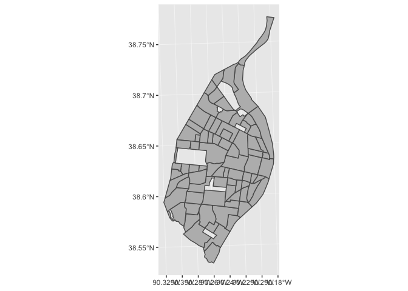<!-- -->

You can see empty spaces where there are major parks - if we wanted to
give these a background color, we could add the `city` layer under our
`nhoods` layer. We can also add the `city` layer again on top to give
the city border a pronounced outline. `ggplot2` relies on layering
different geoms to produce complicated plots. We can assign each geom a
specific set of aesthetic characteristics and use data from different
objects.

``` r
ggplot() +
  geom_sf(data = city, fill = "#ffffff", color = NA) +
  geom_sf(data = nhoods, fill = "#bababa") +
  geom_sf(data = city, fill = NA, color = "#000000", size = .75)
```

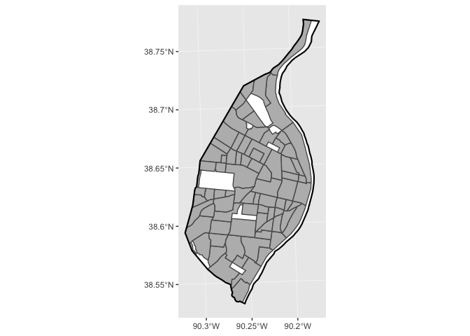<!-- -->

### Mapping Quantities with `ggplot2`

If we wanted to start to map data instead of just the geometric
properties, we would specify an “aesthetic mapping” using `mapping=
aes()` in the geom of interest. Here, we create a fill that is the
product of taking the population in 2017 and normalizing it by square
kilometers as we did in the `leaflet` section above. We provide
additional instructions about how our data should be colored with the
`scale_fill_distiller()` function, which gives us access to the
`RColorBrewer` palettes.

``` r
# create ggplot object
ggplot() +
  geom_sf(data = city, fill = "#ffffff", color = NA) +
  geom_sf(data = nhoods, mapping = aes(fill = pop17/(AREA/1000000))) +
  geom_sf(data = city, fill = NA, color = "#000000", size = .75) +
  scale_fill_distiller(palette = "Greens", trans = "reverse") -> ggplot_17_1

# print object
ggplot_17_1
```

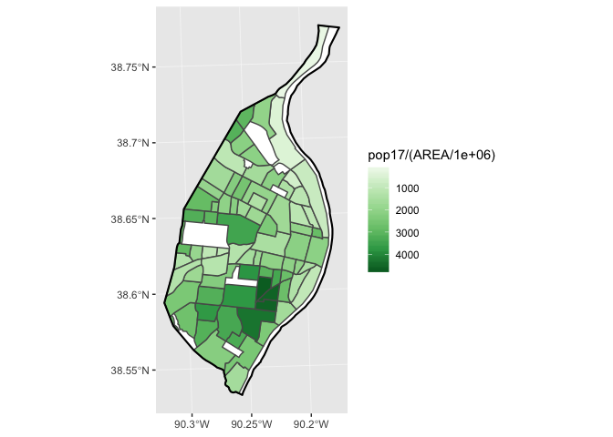<!-- -->

This map also stores our `ggplot` object in its own space in our global
environment. This allows us the ability to update it later, and to more
easily save it.

### Creating Map Layouts with `ggplot2`

Before we save it, however, we should create a more substantial layout.
We’ll use the `name` argument in `scale_fill_distiller()` to name the
legend, the `labs()` function to add text to our layout, and
`theme_minimal()` to remove some of the default `ggplot2` theme
elements:

``` r
# create ggplot object
ggplot() +
  geom_sf(data = city, fill = "#ededed", color = NA) +
  geom_sf(data = nhoods, mapping = aes(fill = pop17/(AREA/1000000))) +
  geom_sf(data = city, fill = NA, color = "#000000", size = .75) +
  scale_fill_distiller(palette = "Greens", trans = "reverse", name = "Population per\nSquare Kilometer") +
  labs(
    title = "Population Density (2017)",
    subtitle = "Neighborhoods in St. Louis, MO",
    caption = "Map by Christopher Prener, Ph.D."
  ) +
  theme_minimal() -> ggplot_17_2

# print object
ggplot_17_2
```

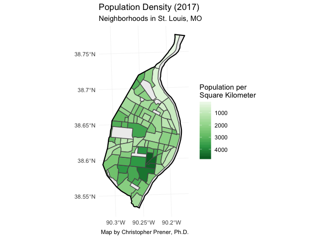<!-- -->

Next, to save our map, we use the `ggsave()`
function:

``` r
ggsave(here("examples", "results", "ggplot2_popDensity17.png"), ggplot_17_2, dpi = 500)
```

    ## Saving 7 x 5 in image

We can repeat this process for the 1950 data:

``` r
# create ggplot object
ggplot() +
  geom_sf(data = city, fill = "#ededed", color = NA) +
  geom_sf(data = nhoods, mapping = aes(fill = pop50/(AREA/1000000))) +
  geom_sf(data = city, fill = NA, color = "#000000", size = .75) +
  scale_fill_distiller(palette = "Blues", trans = "reverse", name = "Population per\nSquare Kilometer") +
  labs(
    title = "Population Density (1950)",
    subtitle = "Neighborhoods in St. Louis, MO",
    caption = "Map by Christopher Prener, Ph.D."
  ) +
  theme_minimal() -> ggplot_17_3

# print object
ggplot_17_3
```

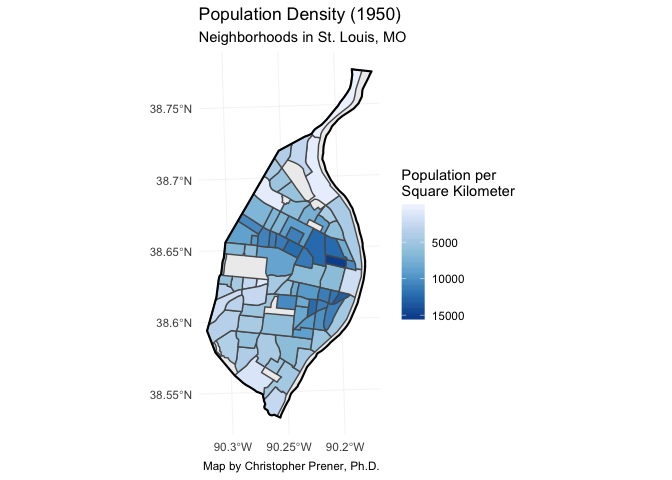<!-- -->

To save our map, we again use the `ggsave()`
function:

``` r
ggsave(here("examples", "results", "ggplot2_popDensity50.png"), ggplot_17_3, dpi = 500)
```

    ## Saving 7 x 5 in image

### Using `viridis` with `ggplot2`

The other option for color palettes is the `viridis` family of palettes.
These are specified by replacing `scale_fill_distiller()` with
`scale_fill_viridis()`. The `option` argument replaces `palette`, but
`name` has the same functionality:

``` r
# create ggplot object
ggplot() +
  geom_sf(data = city, fill = "#ededed", color = NA) +
  geom_sf(data = nhoods, mapping = aes(fill = pop17/(AREA/1000000))) +
  geom_sf(data = city, fill = NA, color = "#000000", size = .75) +
  scale_fill_viridis(option = "cividis", name = "Population per\nSquare Kilometer") +
  labs(
    title = "Population Density (2017)",
    subtitle = "Neighborhoods in St. Louis, MO",
    caption = "Map by Christopher Prener, Ph.D."
  ) +
  theme_minimal() -> ggplot_17_4

# print object
ggplot_17_4
```

<!-- -->

The other options for `viridis` are `viridis`, `magma`, `plasma`, and
`inferno`:

``` r
# create ggplot object
ggplot() +
  geom_sf(data = city, fill = "#ededed", color = NA) +
  geom_sf(data = nhoods, mapping = aes(fill = pop17/(AREA/1000000))) +
  geom_sf(data = city, fill = NA, color = "#000000", size = .75) +
  scale_fill_viridis(option = "viridis", name = "Population per\nSquare Kilometer") +
  labs(
    title = "Population Density (2017)",
    subtitle = "Neighborhoods in St. Louis, MO",
    caption = "Map by Christopher Prener, Ph.D."
  ) +
  theme_minimal() -> ggplot_17_5

# print object
ggplot_17_5
```

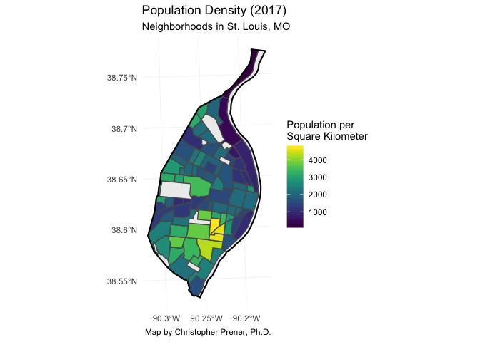<!-- -->

To save our map, we again use the `ggsave()`
function:

``` r
ggsave(here("examples", "results", "ggplot2_popDensity17_2.png"), ggplot_17_5, dpi = 500)
```

    ## Saving 7 x 5 in image

## Managing Our Enviornment

With GIS work, our environment gets cluttered. As I work on an analysis,
I find it useful to remove objects once I know that I am done with them.
We use the `base::rm()` function to do this:

``` r
rm(ggplot_17_1, ggplot_17_2, ggplot_17_3, ggplot_17_4, ggplot_17_5)
```

## Map Layouts with `tmap`

`tmap` uses a similar logic to `ggplot2` - it layers elements on top of
each other to produce maps. It is dedicated to working with spatial
data, however, and has some features that `ggplot2` does not.

### Basic Mapping of Geometric Objects

We’ll start with a basic map that, like we have previously, just display
the geometry of the city’s neighborhoods. Similar to `ggplot2`,
functions are chained together with the `+` sign. We can read these like
paragraphs:

1.  First, we take the `nhoods` data, **then**
2.  we create our `tmap` layer out of its shape, **then**
3.  we add a fill using our layer, **then**
4.  we add borders using our layer.

<!-- end list -->

``` r
nhoods %>%
  tm_shape() +
    tm_fill() +
    tm_borders() 
```

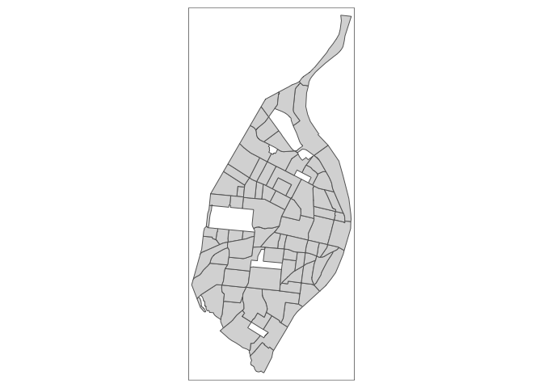<!-- -->

### Mapping Quantities with `tmap`

Like `ggplot2`, we can plot quantities using the `tm_polygons()`
function. The `palette` argument accepts names of both `RColorBrewer`
and `viridis` palettes.

``` r
nhoods %>%
  tm_shape() +
    tm_polygons(col = "pop17", palette = "Greens")
```

    ## Some legend labels were too wide. These labels have been resized to 0.47, 0.44, 0.44. Increase legend.width (argument of tm_layout) to make the legend wider and therefore the labels larger.

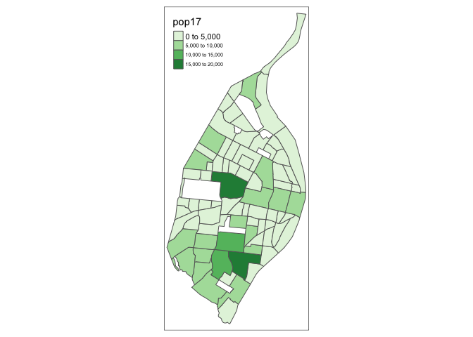<!-- -->

Notice that this is a map of population counts, and is therefore not
normalized. `tamp` makes the normalization process easy, with the
`convert2density` argument:

``` r
nhoods %>%
  tm_shape() +
    tm_polygons(col = "pop17", palette = "Reds", convert2density = TRUE)
```

    ## Some legend labels were too wide. These labels have been resized to 0.51, 0.51, 0.51, 0.51. Increase legend.width (argument of tm_layout) to make the legend wider and therefore the labels larger.

<!-- -->

We can shrink (or grow) the number of classes using the `n` argument in
`tm_polygons`, though I’ve found it to be unreliable occasionally:

``` r
nhoods %>%
  tm_shape() +
    tm_polygons(col = "pop17", 
                palette = "BuPu", 
                n = 3,
                convert2density = TRUE)
```

    ## Some legend labels were too wide. These labels have been resized to 0.51, 0.51. Increase legend.width (argument of tm_layout) to make the legend wider and therefore the labels larger.

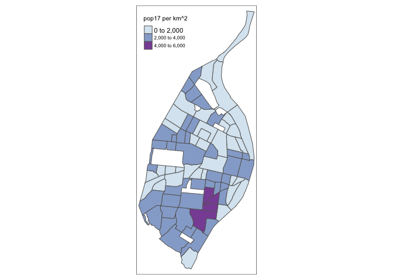<!-- -->

We can also change the breaks are calculated. `tmap` uses the `"pretty"`
approach by default, whereas ArcGIS uses the `"jenks"` approach. We can
mirror ArcGIS by specifying `"jenks"`, and can continue to adjust the
number of breaks:

``` r
nhoods %>%
  tm_shape() +
    tm_polygons(col = "pop17", 
                palette = "BuPu", 
                style = "jenks",
                n = 6,
                convert2density = TRUE)
```

    ## Legend labels were too wide. The labels have been resized to 0.59, 0.51, 0.51, 0.51, 0.51, 0.51. Increase legend.width (argument of tm_layout) to make the legend wider and therefore the labels larger.

<!-- -->

Another option is to use the `"equal"` approach to breaks, which divides
our observations into equally sized classes:

``` r
nhoods %>%
  tm_shape() +
    tm_polygons(col = "pop17", 
                palette = "BuPu", 
                style = "equal",
                n = 6,
                convert2density = TRUE)
```

    ## Some legend labels were too wide. These labels have been resized to 0.59, 0.51, 0.51, 0.51, 0.51. Increase legend.width (argument of tm_layout) to make the legend wider and therefore the labels larger.

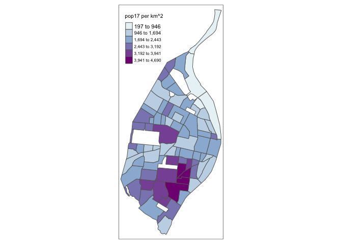<!-- -->

### Creating Map Layouts with `tmap`

Once we have a map we like, we can begin to build a layout around it.
Like with our `ggplot2` map layout, we’ll add the city underneath by
adding a shape below `nhoods`. We’ll use the `city` data for this. We’ll
add the `city` on top as well to achieve that outline effect we
discussed with `ggplot2` as well:

``` r
tm_shape(city) +
  tm_fill(fill = "#ebebeb") + 
  tm_shape(nhoods) +
  tm_polygons(col = "pop17", 
              palette = "viridis", 
              style = "jenks",
              convert2density = TRUE) +
  tm_shape(city) +
  tm_borders(lwd = 2)
```

    ## Legend labels were too wide. The labels have been resized to 0.64, 0.56, 0.56, 0.56, 0.56. Increase legend.width (argument of tm_layout) to make the legend wider and therefore the labels larger.

<!-- -->

Notice how we have to add each layer using `tm_shape()` before beginning
to modify its atheistic properties.

We can also add adornments to our map layouts, including a scale bar
(with `tm_scale_bar()`):

``` r
tm_shape(city) +
  tm_fill(fill = "#ebebeb") + 
  tm_shape(nhoods) +
  tm_polygons(col = "pop17", 
              palette = "viridis", 
              style = "jenks",
              convert2density = TRUE) +
  tm_shape(city) +
  tm_borders(lwd = 2) +
  tm_scale_bar() 
```

    ## Legend labels were too wide. The labels have been resized to 0.64, 0.56, 0.56, 0.56, 0.56. Increase legend.width (argument of tm_layout) to make the legend wider and therefore the labels larger.

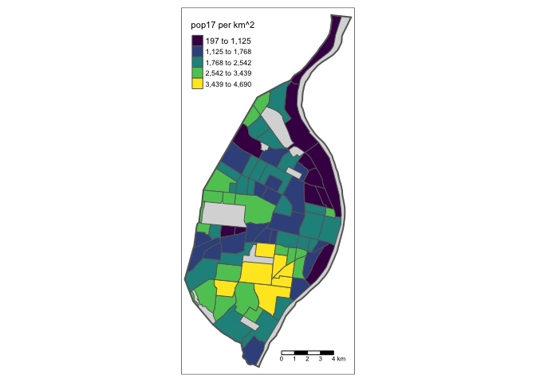<!-- -->

Once we have a layout that we like, we can use `tm_layout()` to add a
title and move the legend if necessary.

``` r
# create tmap object
tm_shape(city) +
  tm_fill(fill = "#ebebeb") + 
  tm_shape(nhoods) +
  tm_polygons(col = "pop17", 
              palette = "viridis", 
              style = "jenks",
              convert2density = TRUE,
              title = "Population per\nSquare Kilometer") +
  tm_shape(city) +
  tm_borders(lwd = 2) +
  tm_scale_bar() +
  tm_layout(
    title = "Population Density (2017)",
    frame = FALSE,
    legend.outside = TRUE,
    legend.position = c("left", "bottom")) -> tmap_17_1

# print object
tmap_17_1
```

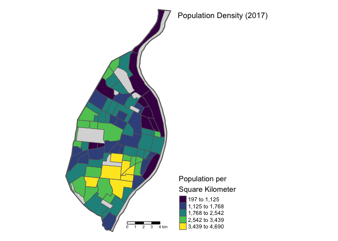<!-- -->

`tmap` lacks the ability to add subtitles and captions to plot layouts,
which is a drawback. Once we have our object created, we can save it
using `tmap_save()`, which is functionally the same as
`ggplot2::ggsave()` but with slightly different
arguments:

``` r
tmap_save(tm = tmap_17_1, filename = here("examples", "results", "tamp_popDensity17_1.png"), dpi = 500)
```

    ## Map saved to /Users/chris/GitHub/SOC5650/LectureRepos/lecture-06/examples/results/tamp_popDensity17_1.png

    ## Resolution: 3500 by 2500 pixels

    ## Size: 7 by 5 inches (500 dpi)

### Adding Histograms

One neat feature that `tmap` has is the ability to add a histogram of
the mapped variable to the legend as well. This is done by adding
`legend.hist = TRUE` to the `tm_polygons()` function:

``` r
# create tmap object
tm_shape(city) +
  tm_fill(fill = "#ebebeb") + 
  tm_shape(nhoods) +
  tm_polygons(col = "pop17", 
              palette = "GnBu", 
              style = "jenks",
              convert2density = TRUE,
              title = "Population per\nSquare Kilometer",
              legend.hist = TRUE) +
  tm_shape(city) +
  tm_borders(lwd = 2) +
  tm_scale_bar() +
  tm_layout(
    title = "Population Density (2017)",
    frame = FALSE,
    legend.outside = TRUE,
    legend.position = c("left", "bottom")) -> tmap_17_2

# print object
tmap_17_2
```

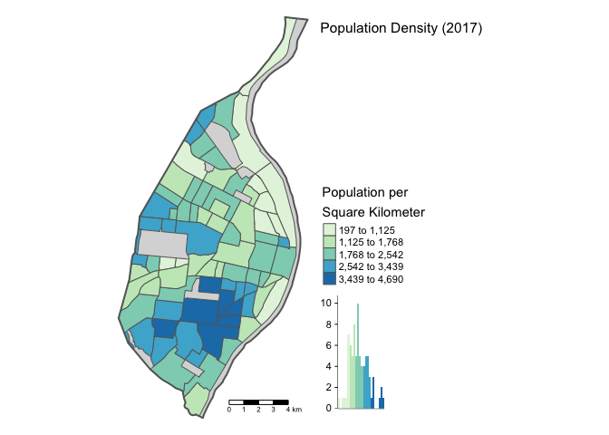<!-- -->

Once again, we can save this using
`tmap_save()`:

``` r
tmap_save(tm = tmap_17_2, filename = here("examples", "results", "tamp_popDensity17_2.png"), dpi = 500)
```

    ## Map saved to /Users/chris/GitHub/SOC5650/LectureRepos/lecture-06/examples/results/tamp_popDensity17_2.png

    ## Resolution: 3500 by 2500 pixels

    ## Size: 7 by 5 inches (500 dpi)
